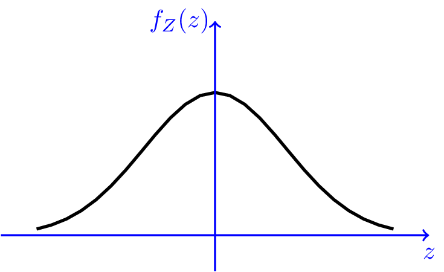
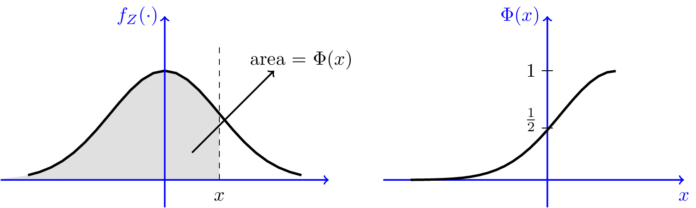
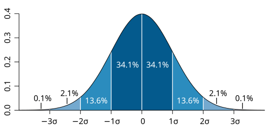
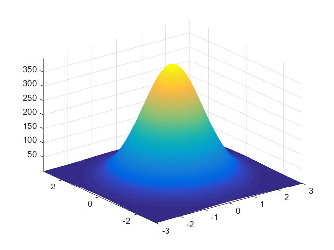
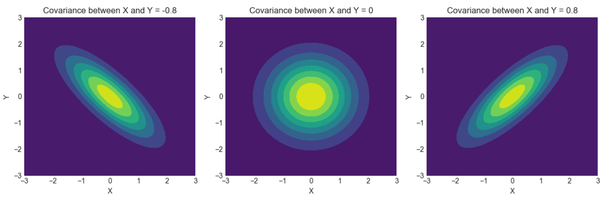

# Gaussian Random Variables

## Introduction
A **Gaussian random variable** (or **Normal random variable**) is a continuous random variable with a bell-shaped probability distribution. It is one of the most widely used distributions in probability and statistics due to the **Central Limit Theorem**, which states that the sum of many independent random variables tends to follow a normal distribution, regardless of the original distributions of the variables. Therefore, a simple Gaussian assumption for a naturally occuring distribution often tends to provide accurate analysis of the system. We define and study both 1-d and 2-d Gaussian Random Variables in this experiment.

## 1D (Univariate) Gaussian Random Variable 

### Definition
A 1D Gaussian random variable $X$ denoted as $X \sim N(\mu, \sigma^2)$, is characterized by two parameters:
- **Mean** $\mu$ (center of the distribution)
- **Variance** $\sigma^2$ (spread of the distribution)

  

The probability density function (PDF) of $X$ is given by:

$$
f_X(x) = \frac{1}{\sqrt{2\pi \sigma^2}} \exp\left( -\frac{(x - \mu)^2}{2\sigma^2} \right)
$$

### Properties 
1. **Symmetry**: The normal distribution is symmetric around its mean $\mu$.
3. **Standard Normal Distribution**: When $\mu = 0$ and $\sigma^2 = 1$, the Gaussian random variable is called a **standard normal variable**, denoted by $Z \sim N(0, 1)$. Its PDF is:

$$
f_Z(z) = \frac{1}{\sqrt{2\pi}} \exp\left( -\frac{z^2}{2} \right)
$$

4. **Transformation of a Gaussian Random Variable**:
   - If $X \sim N(\mu, \sigma^2)$, and we transform $Y = aX + b$, then $Y \sim N(a\mu + b, a^2\sigma^2)$.
  
### Cumulative Distribution Function (CDF)
The CDF of a normal variable is denoted by $\Phi(x)$, which is the probability that $X \leq x$:

$$
P(X \leq x) = \Phi\left( \frac{x - \mu}{\sigma} \right)
$$

However, there is no closed-form expression for $\Phi(x)$; it is generally computed numerically.

### Properties of CDF
Here are some properties of the $\Phi$ function that can be shown from its definition.

  

1. $\lim _{x \rightarrow \infty} \Phi(x)=1, \lim _{x \rightarrow-\infty} \Phi(x)=0$ ；
2. $\Phi(0)=\frac{1}{2}$;
3. $\Phi(-x)=1-\Phi(x)$, for all $x \in \mathbb{R}$.
4. About 68% of values drawn from a normal distribution are within one standard deviation σ from the mean; about 95% of the values lie within two standard deviations; and about 99.7% are within three standard deviations. More precisely, the probability that a normal deviate lies in the range between 
$\mu -n \sigma$ and $\mu + n \sigma$ is given by
$$
F(\mu+n \sigma)-F(\mu-n \sigma)=\Phi(n)-\Phi(-n)=\operatorname{erf}\left(\frac{n}{\sqrt{2}}\right)
$$

  

Also, since the $\Phi$ function does not have a closed form, it is sometimes useful to use upper or lower bounds. In particular we can state the following bounds. For all $x \geq 0$,
$$
\frac{1}{\sqrt{2 \pi}} \frac{x}{x^2+1} \exp \left\{-\frac{x^2}{2}\right\} \leq 1-\Phi(x) \leq \frac{1}{\sqrt{2 \pi}} \frac{1}{x} \exp \left\{-\frac{x^2}{2}\right\}
$$

### Central Limit Theorem (CLT)
The CLT states that the sum (or average) of a large number of independent and identically distributed (i.i.d.) random variables tends to be normally distributed, even if the original variables are not normal.

---
## 2D Gaussian Random Variable (Bivariate Normal Distribution)

### Definition
A **bivariate normal distribution** describes two jointly normal random variables $X$ and $Y$ with the following parameters:
- **Means**: $\mu_X$, $\mu_Y$
- **Variances**: $\sigma_X^2$, $\sigma_Y^2$
- **Covariance**: $\sigma_{XY}$ (or equivalently, the correlation $\rho$)

We denote this as:

$$
\begin{pmatrix} X \\ Y \end{pmatrix} \sim N\left( \begin{pmatrix} \mu_X \\ \mu_Y \end{pmatrix}, \begin{pmatrix} \sigma_X^2 & \sigma_{XY} \\ \sigma_{XY} & \sigma_Y^2 \end{pmatrix} \right)
$$

### Joint Probability Density Function (PDF)
The joint probability density function (PDF) of $X$ and $Y$ is given by:

$$
f_{X,Y}(x, y) = \frac{1}{2\pi \sigma_X \sigma_Y \sqrt{1 - \rho^2}} \exp\left( -\frac{1}{2(1 - \rho^2)} \left[ \frac{(x - \mu_X)^2}{\sigma_X^2} + \frac{(y - \mu_Y)^2}{\sigma_Y^2} - \frac{2\rho(x - \mu_X)(y - \mu_Y)}{\sigma_X \sigma_Y} \right] \right)
$$
Where:
- $\mu_X$, $\mu_Y$ are the means of $X$ and $Y$
- $\sigma_X^2$, $\sigma_Y^2$ are the variances of $X$ and $Y$
- $\rho$ is the correlation coefficient between $X$ and $Y$, given by $\rho = \frac{\sigma_{XY}}{\sigma_X \sigma_Y}$

Below is an example of how pdf 2D-Gaussian Random variable looks.

  

### Key Properties of the Bivariate Normal Distribution
1. **Marginal Distributions**: 
   - The marginal distribution of $X$ is $X \sim N(\mu_X, \sigma_X^2)$.
   - The marginal distribution of $Y$ is $Y \sim N(\mu_Y, \sigma_Y^2)$.
   - This means that each random variable $X$ and $Y$ follows a normal distribution independently, but their joint behavior is governed by the covariance or correlation.

2. **Independence**:
   - If $\rho = 0$, then $X$ and $Y$ are independent. In other words, zero correlation implies independence for jointly normal random variables.
   - **Example**:
     - Let $X$ and $Y$ be independent random variables with means $0$ and standard deviations $1$. This means $\rho = 0$. Then the joint PDF simplifies to:

     $$
     f_{X,Y}(x, y) = \frac{1}{2\pi} \exp\left( -\frac{1}{2} \left[ x^2 + y^2 \right] \right)
     $$

     This is simply the product of two univariate standard normal PDFs.

3. **Conditional Distribution**:
   - The conditional distribution of $Y$ given $X = x$ is normal, with the following parameters:
     - Mean: $\mu_{Y|X} = \mu_Y + \rho \frac{\sigma_Y}{\sigma_X}(x - \mu_X)$
     - Variance: $\sigma_{Y|X}^2 = (1 - \rho^2) \sigma_Y^2$

   - **Example**:
     - Suppose $X$ and $Y$ are normally distributed with $\mu_X = 2$, $\mu_Y = 3$, $\sigma_X = 1$, $\sigma_Y = 2$, and $\rho = 0.5$. If $X = 3$, then the conditional distribution of $Y$ given $X = 3$ is:

     $$
     Y | X = 3 \sim N\left( 3 + 0.5 \times \frac{2}{1}(3 - 2), (1 - 0.5^2) \times 2^2 \right)
     $$

     Simplifying:

     $$
     Y | X = 3 \sim N(4, 3)
     $$

     Therefore, $Y$ given $X = 3$ is normally distributed with a mean of 4 and variance of 3.

4. **Covariance Matrix**:
   - The covariance matrix $\Sigma$ for a bivariate normal distribution summarizes the variances and covariances of the random variables:

     $$
     \Sigma = \begin{pmatrix} \sigma_X^2 & \sigma_{XY} \\ \sigma_{XY} & \sigma_Y^2 \end{pmatrix}
     $$

   - In terms of the correlation coefficient $\rho$, the covariance $\sigma_{XY}$ is given by:

     $$
     \sigma_{XY} = \rho \sigma_X \sigma_Y
     $$

     Therefore, the covariance matrix can also be expressed as:

     $$
     \Sigma = \begin{pmatrix} \sigma_X^2 & \rho \sigma_X \sigma_Y \\ \rho \sigma_X \sigma_Y & \sigma_Y^2 \end{pmatrix}
     $$
   

### Example: Computing Covariance Matrix and Joint PDF
Let $X$ and $Y$ be jointly normal with the following parameters:
- $\mu_X = 1$, $\mu_Y = 2$
- $\sigma_X = 1$, $\sigma_Y = 2$
- $\rho = 0.6$

1. **Covariance Matrix**:
   Using $\sigma_{XY} = \rho \sigma_X \sigma_Y = 0.6 \times 1 \times 2 = 1.2$, the covariance matrix is:

   $$
   \Sigma = \begin{pmatrix} 1 & 1.2 \\ 1.2 & 4 \end{pmatrix}
   $$

2. **Joint PDF**:
   The joint PDF is:

   $$
   f_{X,Y}(x, y) = \frac{1}{2\pi \cdot 1 \cdot 2 \cdot \sqrt{1 - 0.6^2}} \exp\left( -\frac{1}{2(1 - 0.6^2)} \left[ \frac{(x - 1)^2}{1^2} + \frac{(y - 2)^2}{2^2} - \frac{2 \cdot 0.6 \cdot (x - 1)(y - 2)}{1 \cdot 2} \right] \right)
   $$

   Simplifying the coefficient in front:

   $$
   \frac{1}{2\pi \cdot 2 \cdot \sqrt{1 - 0.36}} = \frac{1}{4\pi \cdot \sqrt{0.64}} = \frac{1}{4\pi \cdot 0.8} = \frac{1}{3.2\pi}
   $$

   Therefore, the joint PDF is:

   $$
   f_{X,Y}(x, y) = \frac{1}{3.2\pi} \exp\left( -\frac{1}{1.28} \left[ (x - 1)^2 + \frac{(y - 2)^2}{4} - 0.6(x - 1)(y - 2) \right] \right)
   $$

### Linear Combinations of Gaussian Random Variables
A key result of the bivariate normal distribution is that any linear combination of $X$ and $Y$, say $Z = aX + bY$, is also normally distributed.

- The mean of $Z$ is: $\mu_Z = a\mu_X + b\mu_Y$
- The variance of $Z$ is: $\sigma_Z^2 = a^2 \sigma_X^2 + b^2 \sigma_Y^2 + 2ab \sigma_{XY}$

#### Example:
Let $X$ and $Y$ be normally distributed with the following parameters:
- $\mu_X = 1$, $\mu_Y = 2$
- $\sigma_X = 1$, $\sigma_Y = 2$
- $\rho = 0.5$, $\sigma_{XY} = 1$

Now consider $Z = X + 2Y$.

1. **Mean**:
   $$
   \mu_Z = \mu_X + 2\mu_Y = 1 + 2 \times 2 = 5
   $$

2. **Variance**:
   $$
   \sigma_Z^2 = 1^2 \times 1^2 + 2^2 \times 2^2 + 2 \times 1 \times 2 \times 1 = 1 + 16 + 4 = 21
   $$

Thus, $Z \sim N(5, 21)$.

## Isocontours

A simple and intuituve way to visualize and understand bi-variate gaussian random variables is by *iso-contours*. Formally, for a function $f$, **iso-contours** are defined as a set of points given by

   $$
   \{x \in \mathbb{R}^2 : f(x)=c\} \quad \text{for some $c \in \mathbb{R}$}
   $$

Now we study the shape of iso-contours, which will be helpful in visualizing 2D-Gaussian Random Variables' distribution. In order to obtain the shape of the iso-contours, we need to solve the equation $p(x;\mu,\Sigma)=c$ for some constant $c \in \mathbb{R}$.

$$
p(x ; \mu, \Sigma)=\frac{1}{2 \pi \sigma_1 \sigma_2} \exp \left(-\frac{1}{2 \sigma_1^2}\left(x_1-\mu_1\right)^2-\frac{1}{2 \sigma_2^2}\left(x_2-\mu_2\right)^2\right)
$$

Now, let's consider the level set consisting of all points where $p(x ; \mu, \Sigma)=c$ for some constant $c \in \mathbf{R}$. In particular, consider the set of all $x_1, x_2 \in \mathbf{R}$ such that
$$
\begin{aligned}
c & =\frac{1}{2 \pi \sigma_1 \sigma_2} \exp \left(-\frac{1}{2 \sigma_1^2}\left(x_1-\mu_1\right)^2-\frac{1}{2 \sigma_2^2}\left(x_2-\mu_2\right)^2\right) \\
2 \pi c \sigma_1 \sigma_2 & =\exp \left(-\frac{1}{2 \sigma_1^2}\left(x_1-\mu_1\right)^2-\frac{1}{2 \sigma_2^2}\left(x_2-\mu_2\right)^2\right) \\
\log \left(2 \pi c \sigma_1 \sigma_2\right) & =-\frac{1}{2 \sigma_1^2}\left(x_1-\mu_1\right)^2-\frac{1}{2 \sigma_2^2}\left(x_2-\mu_2\right)^2 \\
\log \left(\frac{1}{2 \pi c \sigma_1 \sigma_2}\right) & =\frac{1}{2 \sigma_1^2}\left(x_1-\mu_1\right)^2+\frac{1}{2 \sigma_2^2}\left(x_2-\mu_2\right)^2 \\
1 & =\frac{\left(x_1-\mu_1\right)^2}{2 \sigma_1^2 \log \left(\frac{1}{2 \pi c \sigma_1 \sigma_2}\right)}+\frac{\left(x_2-\mu_2\right)^2}{2 \sigma_2^2 \log \left(\frac{1}{2 \pi c \sigma_1 \sigma_2}\right)}
\end{aligned}
$$

Defining
$$
r_1=\sqrt{2 \sigma_1^2 \log \left(\frac{1}{2 \pi c \sigma_1 \sigma_2}\right)} \quad r_2=\sqrt{2 \sigma_2^2 \log \left(\frac{1}{2 \pi c \sigma_1 \sigma_2}\right)}
$$
it follows that
$$
1=\left(\frac{x_1-\mu_1}{r_1}\right)^2+\left(\frac{x_2-\mu_2}{r_2}\right)^2
$$

The obtained equation is that of an axis-aligned ellipse, with center $\left(\mu_1, \mu_2\right)$, where the $x_1$ axis has length $2 r_1$ and the $x_2$ axis has length $2 r_{2}$. Thus, iso-contours in gaussian random vectors are ellipses.

 Note that when $\sigma_1=\sigma_2$, we have $r_1=r_2$ and thus, the ellipse reduces to a circle. Also, it is interesting to note that the principal axis of the ellipse determines the covariance between the 2 marginal distributions $X$ and $Y$. A positive value of $\rho$ means a positive slope and a negative value indicates a negative slope.

---
